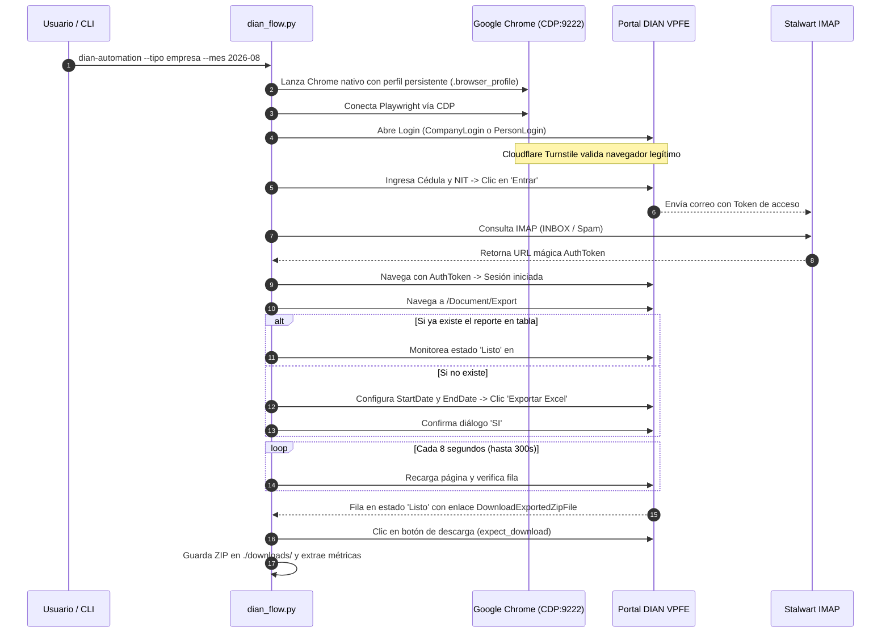

# 🤖 DianAutomation - Extractor Desatendido de Listados DIAN VPFE

[](https://python.org)
[](https://playwright.dev)
[](docs/ARCHITECTURE.md)
[](docs/decisions/README.md)
[](#-ejecución-de-pruebas-unitarias)

Automatización end-to-end de alta fidelidad para el portal de Facturación Electrónica de la **DIAN (VPFE)** en Colombia (ambientes de **Habilitación** y **Producción**). 

Permite iniciar sesión como **Persona Natural** o **Empresa (Representante Legal)**, resolver automáticamente la verificación de **Cloudflare Turnstile**, capturar en tiempo real el correo con el **enlace mágico de acceso (Token)** desde un servidor **Stalwart IMAP**, solicitar la exportación de documentos para cualquier mes y descargar de forma completamente desatendida el archivo **ZIP/Excel** generado.

> ⏱️ **Inicio Rápido en 30 Segundos:**
> ```bash
> uv run dian-automation --tipo empresa --mes 2026-08
> ```
> *(Lee credenciales directamente desde `.env` y descarga el listado a `./downloads/`)*.

---

## 📑 Tabla de Contenido
1. [Características Principales](#-características-principales)
2. [Arquitectura y Funcionamiento](#-arquitectura-y-funcionamiento)
3. [Requisitos Previos](#-requisitos-previos)
4. [Estructura del Proyecto](#-estructura-del-proyecto)
5. [Instalación Paso a Paso](#-instalación-paso-a-paso)
6. [Configuración (.env)](#-configuración-env)
7. [Guía de Uso por Línea de Comandos (CLI)](#-guía-de-uso-por-línea-de-comandos-cli)
   - [Modo Empresa (Representante Legal)](#1-modo-empresa-representante-legal)
   - [Modo Persona Natural](#2-modo-persona-natural)
   - [Modo Token Directo (Sesión Activa)](#3-modo-token-directo-sesión-activa)
   - [Opciones y Argumentos CLI](#4-resumen-de-argumentos-cli)
8. [Manejo de Descargas y Evidencias](#-manejo-de-descargas-y-evidencias)
9. [Ejecución de Pruebas Unitarias](#-ejecución-de-pruebas-unitarias)
10. [Preguntas Frecuentes y Solución de Problemas](#-preguntas-frecuentes-y-solución-de-problemas)

---

## ⚡ Características Principales

- **Evasión Anti-Detección Cloudflare Turnstile:** En lugar de lanzar navegadores sintéticos con banderas de automatización (`--enable-automation`), lanza una instancia pura de Google Chrome nativo y se conecta a través del protocolo **CDP (Chrome DevTools Protocol)** con perfil persistente. Turnstile se resuelve de forma limpia en 3 a 5 segundos.
- **Soporte Dual: Persona Natural y Empresa:** Compatible con login individual (cédula) y corporativo (cédula del representante legal + NIT de la empresa).
- **Sanitización Inteligente de Documentos:** Acepta NITs con cualquier formato (`901.008.579-8`, `901008579-8` o `901008579`), descartando automáticamente el dígito de verificación (DV) y caracteres no numéricos según las reglas del portal.
- **Lector Automático de Token IMAP (Stalwart):** Monitorea concurrentemente las carpetas `INBOX`, `Junk Mail` y `Spam` del servidor Stalwart, parseando el correo HTML de la DIAN y extrayendo el enlace de autenticación en menos de 1 segundo.
- **Sincronización Rápida de Fechas (0.02s):** Ajusta directamente el widget interno `DateRangePicker` y los campos de formulario ocultos (`#StartDate` y `#EndDate`) mediante inyección JavaScript controlada, evitando los lentos clics de calendario manual.
- **Detección de Tareas Preexistentes:** Verifica la tabla `#tableExport` antes de solicitar un nuevo reporte para evitar duplicar exportaciones en la DIAN.
- **Sondeo Inteligente y Descarga Asíncrona:** Espera hasta 300 segundos a que la DIAN termine de generar el reporte (pasando de `⟳ En proceso` a `✔ Listo`), recargando la tabla contra el servidor y capturando el archivo `.zip` resultante mediante `expect_download`.
- **Registro Fotográfico Integral:** Almacena capturas de pantalla de alta resolución de cada fase (`screenshot_antes_exportar.png`, `screenshot_encolado.png`, `screenshot_tabla_reportes.png`, `screenshot_descarga_completada.png`).

---

## 🏛️ Arquitectura y Funcionamiento

> 📘 **Documentación de Arquitectura Completa**: Puedes consultar los diagramas **C4 (Contexto, Contenedores y Componentes)** en [docs/ARCHITECTURE.md](docs/ARCHITECTURE.md).



---

## 📦 Requisitos Previos

Antes de ejecutar el proyecto, asegúrate de contar con:

1. **Sistema Operativo:** Windows 10 / 11, Linux o macOS.
2. **Python:** Versión **3.11** o superior (probado y certificado en Python 3.14).
3. **Google Chrome:** Navegador Chrome oficial instalado en la ruta habitual del sistema.
4. **Administrador de paquetes:** Se recomienda [`uv`](https://github.com/astral-sh/uv) para máxima velocidad de instalación y entornos reproducibles, o `pip` estándar.
5. **Buzón Stalwart:** Acceso de lectura al servidor de correo configurado para recibir los tokens de la DIAN.

---

## 📁 Estructura del proyecto

```
ProyectoDianBack/
├── pyproject.toml  uv.lock  .python-version  alembic.ini  docker-compose.yml
├── .env.example  .gitignore  .gitattributes  .dockerignore  README.md
├── src/dian_automation/
│   ├── cli/            puntos de entrada (comandos: kontable-worker-remote, kontable-worker, kontable-scheduler, kontable-bot)
│   ├── api/ core/ db/ extraction/ queue/ subscriptions/ telegram/  (+ config.py, dian_flow.py, mail_client.py)
├── tests/
├── alembic/            migraciones
├── docker/             Dockerfile, entrypoint.sh, pg-backup.sh
├── packaging/          kontable_worker.spec + kontable_worker_entry.py (empaquetado del worker como .exe con PyInstaller)
├── scripts/
│   ├── ops/            install_worker_task.ps1, migrate_sqlite_to_postgres.py
│   └── dev/            seed_demo_data.py, check_turnstile.py
├── data/               calendario_dian_2026.csv
└── docs/               ARCHITECTURE.md, DEPLOYMENT.md, ENVIRONMENT.md, decisions/
```

Carpetas locales que git ignora: `.venv/`, `.env`, `downloads/`, `dist/`, `build/`, `.browser_profile/`, `pending_uploads/`, `backups/`, `scratch/`, `*.db`.

### Qué va dónde

| Ubicación | Descripción |
|---|---|
| `src/` | Código de la aplicación. |
| `src/dian_automation/cli/` | Puntos de entrada de servicios (`kontable-worker-remote`, `kontable-worker`, `kontable-scheduler`, `kontable-bot`). |
| `scripts/ops/` | Scripts operativos (`install_worker_task.ps1`, `migrate_sqlite_to_postgres.py`). |
| `scripts/dev/` | Scripts de desarrollo (`seed_demo_data.py`, `check_turnstile.py`). |
| `packaging/` | Empaquetado del worker como `.exe` con PyInstaller (`kontable_worker.spec`, `kontable_worker_entry.py`). |
| Raíz (`./`) | Archivos de configuración y metadatos. Nada de scripts sueltos ni capturas en la raíz. |

### Comandos principales

| Comando | Descripción |
|---|---|
| `uv run kontable-bot` | Inicia el bot de Telegram para atención y notificaciones. |
| `uv run kontable-worker` | Ejecuta el worker local para procesamiento de colas. |
| `uv run kontable-worker-remote` | Ejecuta el worker remoto de descargas en red residencial. |
| `uv run kontable-scheduler` | Ejecuta el programador de tareas automáticas y alerta de latidos. |
| `uv run alembic upgrade head` | Aplica las migraciones pendientes en la base de datos. |
| `uv run python -m pytest -q` | Ejecuta la suite de pruebas unitarias en modo silencioso. |

---

## 🚀 Instalación Paso a Paso

### Opción A: Con `uv` (Recomendada)

1. **Clonar el repositorio:**
   ```bash
   git clone https://github.com/tu-usuario/ProyectoDian.git
   cd ProyectoDian
   ```

2. **Crear el entorno virtual y sincronizar dependencias:**
   ```bash
   uv sync
   ```

3. **Instalar los controladores de Playwright:**
   ```bash
   uv run playwright install chromium
   ```

---

### Opción B: Con `pip` y `venv` estándar

1. **Clonar y acceder a la carpeta:**
   ```bash
   git clone https://github.com/tu-usuario/ProyectoDian.git
   cd ProyectoDian
   ```

2. **Crear y activar el entorno virtual:**
   ```bash
   # En Windows PowerShell:
   python -m venv .venv
   .\.venv\Scripts\Activate.ps1

   # En Linux / macOS:
   python3 -m venv .venv
   source .venv/bin/activate
   ```

3. **Instalar dependencias en modo editable:**
   ```bash
   pip install -e .
   playwright install chromium
   ```

---

## ⚙️ Configuración (.env)

> 📋 **Auditoría Completa de Variables:** Para consultar la tabla detallada de todas las variables consumidas en el código fuente, valores por defecto y estados, revisa [docs/ENVIRONMENT.md](docs/ENVIRONMENT.md).

Copia el archivo de ejemplo para crear tu configuración local:

```bash
cp .env.example .env
```

Abre el archivo `.env` y ajusta tus credenciales:

```ini
# ==============================================================================
# CONFIGURACIÓN AUTOMATIZACIÓN DIAN VPFE
# ==============================================================================

# Modalidad de ingreso por defecto: 'persona' o 'empresa'
DIAN_LOGIN_TYPE=persona

# URLs del Portal DIAN (Habilitación o Producción)
# Ambiente de Habilitación:
DIAN_URL=https://catalogo-vpfe-hab.dian.gov.co/User/PersonLogin
DIAN_COMPANY_URL=https://catalogo-vpfe-hab.dian.gov.co/User/CompanyLogin

# Ambiente de Producción (descomentar para producción):
# DIAN_URL=https://catalogo-vpfe.dian.gov.co/User/PersonLogin
# DIAN_COMPANY_URL=https://catalogo-vpfe.dian.gov.co/User/CompanyLogin

# ------------------------------------------------------------------------------
# Credenciales del Contribuyente / Empresa
# ------------------------------------------------------------------------------
# Modo Persona Natural: Cédula de Ciudadanía
DIAN_PERSON_CODE=1000000001

# Modo Empresa: Cédula del Representante Legal y NIT de la Empresa
DIAN_REPRESENTATIVE_CODE=10000002
DIAN_COMPANY_NIT=901008579

# ------------------------------------------------------------------------------
# Servidor de Correo Stalwart (Recepción automática del token mágico)
# ------------------------------------------------------------------------------
STALWART_IMAP_HOST=mail.example.com
STALWART_IMAP_PORT=993
STALWART_USER=token@example.com
STALWART_PASSWORD=tu_contrasena_aqui

# ------------------------------------------------------------------------------
# Opciones de Ejecución y Descarga
# ------------------------------------------------------------------------------
# False: Muestra la ventana de Chrome (vital para Turnstile)
HEADLESS=False

# Tiempo máximo de espera para la llegada del correo con el token (segundos)
EMAIL_TIMEOUT_SECONDS=60

# Tiempo máximo de espera para que la DIAN compile el reporte (segundos)
EXPORT_DOWNLOAD_TIMEOUT_SECONDS=300

# Carpeta de destino donde se guardarán los archivos ZIP
DOWNLOAD_DIR=./downloads
```

---

## 💻 Guía de Uso por Línea de Comandos (CLI)

El proyecto incluye el comando ejecutable `dian-automation`. Puedes invocarlo con `uv run dian-automation` o directamente desde el `.venv`.

### 1. Modo Empresa (Representante Legal)

Inicia sesión seleccionando automáticamente la pestaña *"Representante legal"*, digita la cédula del representante, el NIT de la empresa y descarga el reporte del mes deseado:

```powershell
# Usando uv:
uv run dian-automation --tipo empresa --nit-representante 10000002 --nit-empresa 901008579 --mes 2026-08

# O usando el entorno virtual directo:
.\.venv\Scripts\dian-automation --tipo empresa --nit-representante 10000002 --nit-empresa 901008579 --mes 2026-08
```

> **Nota sobre el NIT:** Puedes escribirlo con o sin formato (`901.008.579-8`, `901008579-8` o `901008579`). El sistema descarta automáticamente los puntos y el dígito de verificación.

---

### 2. Modo Persona Natural

Inicia sesión como Persona Natural con la cédula del titular:

```powershell
uv run dian-automation --tipo persona --cedula 1000000001 --mes 2026-08
```

*(Si omites los parámetros, tomará los valores definidos en `.env`).*

---

### 3. Modo Token Directo (Sesión Activa)

Si ya cuentas con un enlace de token emitido (los enlaces de la DIAN tienen una validez de 60 minutos), puedes saltarte el proceso de login e ir directamente a la exportación y descarga:

```powershell
# En ambiente de Producción:
uv run dian-automation --token-url "https://catalogo-vpfe.dian.gov.co/User/AuthToken?pk=0000000|10000002&rk=901008579&token=00000000-0000-0000-0000-000000000000" --mes 2026-08

# En ambiente de Habilitación:
uv run dian-automation --token-url "https://catalogo-vpfe-hab.dian.gov.co/User/AuthToken?pk=0000000|10000002&rk=901008579&token=00000000-0000-0000-0000-000000000000" --mes 2026-08
```

---

### 4. Resumen de Argumentos CLI

| Argumento | Descripción | Ejemplo | Valor por Defecto |
|---|---|---|---|
| `--tipo` | Modalidad de acceso (`persona` o `empresa`) | `--tipo empresa` | Valor de `DIAN_LOGIN_TYPE` en `.env` |
| `--cedula` | Cédula para modalidad Persona Natural | `--cedula 1000000001` | Valor de `DIAN_PERSON_CODE` en `.env` |
| `--nit-representante` | Cédula del Representante Legal (Empresa) | `--nit-representante 10000002` | Valor de `DIAN_REPRESENTATIVE_CODE` |
| `--nit-empresa` | NIT de la Empresa con o sin DV | `--nit-empresa 901008579` | Valor de `DIAN_COMPANY_NIT` |
| `--mes` | Mes objetivo en formato `YYYY-MM` | `--mes 2026-08` | Mes actual |
| `--token-url` | Enlace mágico ya existente (salta el login) | `--token-url "https://..."` | Ninguno (hace login completo) |
| `--output-dir` | Carpeta para guardar los archivos descargados | `--output-dir "./mis_descargas"` | `./downloads` |
| `--download-timeout`| Segundos máximos de espera para descarga | `--download-timeout 300` | `300` segundos |

---

## 📂 Manejo de Descargas y Evidencias

Una vez finalizada la ejecución, encontrarás los resultados organizados:

### 1. Archivo ZIP y Hoja Excel
- Ubicación: Carpeta `./downloads/` (o la ruta indicada en `--output-dir`).
- El ZIP contiene el listado oficial de la DIAN en formato Excel (`.xlsx`) con todos los comprobantes recibidos y emitidos en el periodo.

### 2. Evidencias Fotográficas
Se escriben automáticamente en el directorio de trabajo desde donde se lanza el proceso (ignoradas por git vía `/*.png`):
- `screenshot_antes_exportar.png`: Demuestra que las fechas fueron ajustadas correctamente en el campo antes de enviar el formulario.
- `screenshot_encolado.png`: Demuestra que la tarea quedó registrada en el servidor de la DIAN.
- `screenshot_tabla_reportes.png`: Captura el estado inicial de la tabla `#tableExport`.
- `screenshot_descarga_completada.png`: Captura el momento exacto en que se presiona el botón verde de descarga.

---

## 🧪 Ejecución de Pruebas Unitarias

La suite de pruebas automatizadas valida la lógica de sanitización, análisis de correos, selectores DOM y parseo de tablas sin requerir conexión a internet:

```bash
uv run pytest
```

Salida esperada:
```
tests\test_download_parser.py ...                                        [ 23%]
tests\test_login_config.py .....                                         [ 61%]
tests\test_mail_parser.py .....                                          [100%]

============================= 13 passed in 0.77s ==============================
```

---

## 🛠️ Runbooks de Operación Frecuente

| Tarea Operativa | Comando PowerShell | Descripción |
| :--- | :--- | :--- |
| **Limpiar instancias Chrome zombie** | `Get-Process chrome -ErrorAction SilentlyContinue \| Where-Object { $_.CommandLine -like "*9222*" } \| Stop-Process -Force` | Libera el puerto de depuración 9222 si un proceso quedó colgado. |
| **Limpiar descargas previas** | `Remove-Item -Path .\downloads\*.zip -Force` | Elimina descargas antiguas para evitar confusiones de reportes. |
| **Ejecución rápida de prueba** | `uv run pytest -v` | Ejecuta la suite de 13 pruebas unitarias sin tocar internet. |
| **Descarga directa con Token** | `uv run dian-automation --token-url "<URL>" --mes 2026-08` | Salta el login si ya tienes un enlace activo de la DIAN. |

---

## ❓ Preguntas Frecuentes y Solución de Problemas

### 1. ¿Por qué se utiliza Google Chrome nativo en lugar del Chromium empaquetado de Playwright?
Cloudflare Turnstile analiza firmas en el motor JavaScript (como `navigator.webdriver`, prototipos de plugins y propiedades de pantalla). Las versiones estándar de Chromium automatizado disparan el error `600010`. Conectando Playwright vía CDP a una instancia de Google Chrome nativo con un perfil persistente, Turnstile valida el entorno como un navegador 100% humano y se resuelve en 3 a 5 segundos (ver detalle en [ADR-001](docs/decisions/ADR-001-evasion-cloudflare-turnstile-cdp.md)).

### 2. Error: `Target page, context or browser has been closed`
Ocurre si el navegador fue cerrado manualmente mientras el script estaba ejecutándose, o si otra instancia de Chrome ya estaba escuchando en el puerto `9222`. Para solucionarlo, ejecuta el comando de limpieza del Runbook arriba.

### 3. ¿Qué ocurre si el correo con el token tarda más de 60 segundos?
Puedes incrementar el tiempo de espera configurando la variable `EMAIL_TIMEOUT_SECONDS=120` en tu archivo `.env`.

### 4. ¿Por qué la DIAN a veces tarda en poner el reporte en estado "Listo"?
Para periodos con miles de facturas (o en horas de alta concurrencia fiscal), la DIAN encola los archivos en un clúster de procesamiento en segundo plano. El parámetro `--download-timeout 300` (5 minutos) permite al bot esperar pacientemente haciendo consultas periódicas hasta que el enlace de descarga esté activo.

### 5. ¿Es compatible tanto con el ambiente de Habilitación como con Producción?
Sí. El bot detecta automáticamente el dominio del token suministrado (`catalogo-vpfe-hab.dian.gov.co` o `catalogo-vpfe.dian.gov.co`) y dirige la navegación de exportación y descarga al host correcto sin perder la sesión.

---

> 📅 **Última revisión técnica:** Septiembre 2026 | **Compatibilidad:** Python 3.11+, 3.14 (Certificado), Google Chrome 120+, Playwright 1.62+

