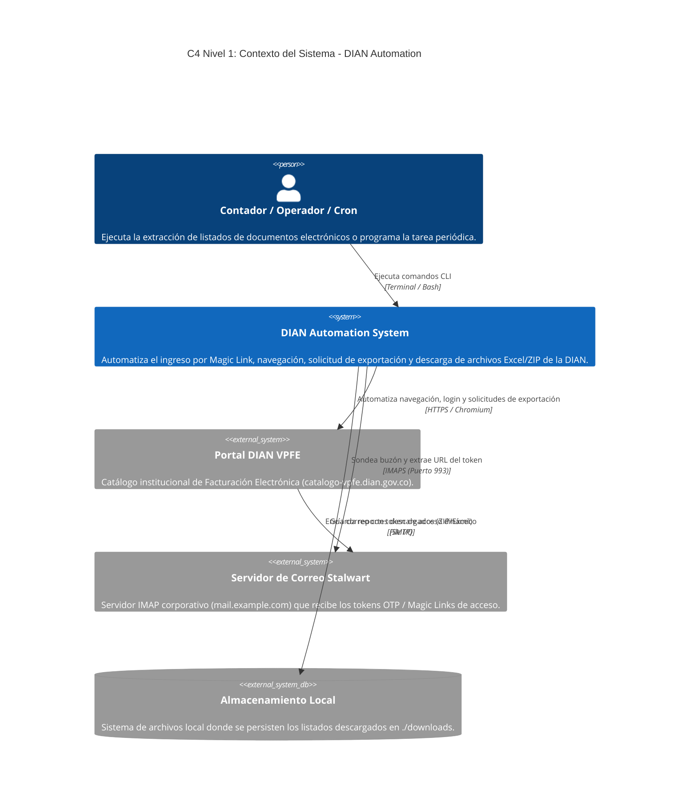
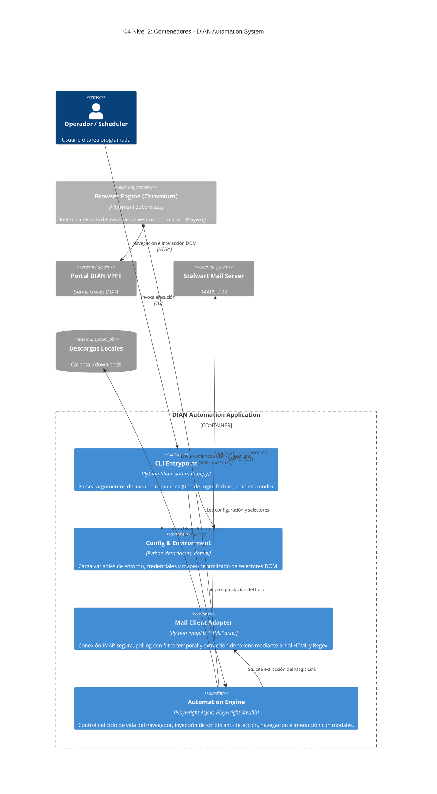
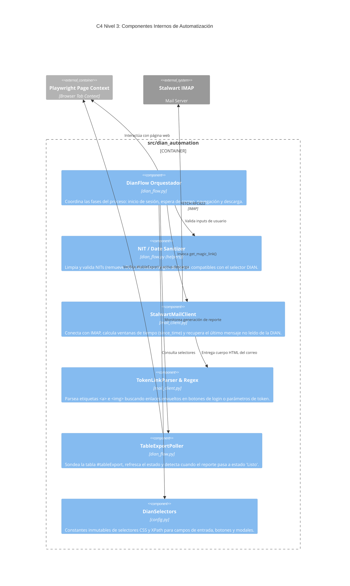
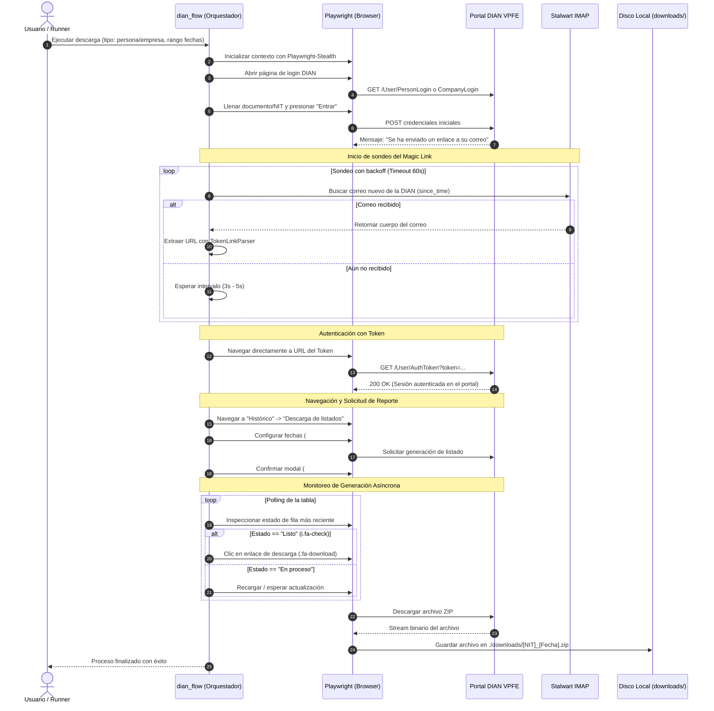

# Arquitectura del Sistema: DIAN VPFE Automation

Este documento describe la arquitectura de software del sistema de automatización para la descarga de listados de facturación electrónica desde el portal **DIAN VPFE** (Validación Previa de Facturación Electrónica), implementado con **Python**, **Playwright** y **Stalwart IMAP**.

La documentación sigue el estándar del **Modelo C4** (*Context*, *Containers*, *Components*) con diagramas interactivos en sintaxis **Mermaid**.

---

## 1. C4 Nivel 1: Diagrama de Contexto del Sistema (System Context)

El diagrama de contexto muestra el sistema de automatización en relación con los usuarios humanos (contadores/operadores) y los sistemas externos con los que interactúa.

### Elementos del Contexto
* **DIAN Automation System**: Núcleo del aplicativo que orquesta la autenticación desatendida mediante lectura en tiempo real del correo, resolución de selectores y polling de la cola de generación de la DIAN.
* **Portal DIAN VPFE**: Aplicación web externa del estado colombiano que protege el acceso mediante tokens de un solo uso enviados al correo registrado en el RUT.
* **Servidor de Correo Stalwart**: Servidor de mensajería empresarial que almacena los correos transaccionales de la DIAN para su lectura inmediata.

---

## 2. C4 Nivel 2: Diagrama de Contenedores (Container Diagram)

Muestra los bloques de construcción ejecutables y entornos que componen el aplicativo.

> 📋 **Variables de Entorno:** Para consultar el inventario completo de variables consumidas por el contenedor de configuración, sus valores por defecto y estado en `.env.example`, consulta [docs/ENVIRONMENT.md](ENVIRONMENT.md).

---

## 3. C4 Nivel 3: Diagrama de Componentes (Component Diagram)

Profundización dentro del **Automation Engine** y del **Mail Client Adapter** para detallar la lógica interna de los módulos de Python.

---

## 4. Diagrama de Secuencia Dinámico (End-to-End Workflow)

Este diagrama de interacción temporal muestra cómo se comunican los componentes durante una ejecución típica completa:

---

## 5. Resumen de Decisiones de Arquitectura Clave (ADRs)

Para conocer el análisis detallado, contexto de requisitos y alternativas descartadas de cada decisión, consulta el directorio de [Registros de Decisiones de Arquitectura (docs/decisions/)](decisions/README.md):

* **[ADR-001: Evasión de Cloudflare Turnstile mediante Chrome Nativo y CDP](decisions/ADR-001-evasion-cloudflare-turnstile-cdp.md)**: Justificación técnica del uso de Chrome oficial vía CDP sobre navegadores sintéticos o servicios de captcha externos.
* **[ADR-002: Autenticación Passwordless y Bypass de Magic Link vía Stalwart IMAP](decisions/ADR-002-autenticacion-passwordless-imap-stalwart.md)**: Justificación del sondeo IMAP con filtro `since_time` y parser dual (HTML + Regex) frente a webhooks HTTP o scrapers de webmail.

| Decisión | Justificación Técnica | ADR Asociado |
| :--- | :--- | :--- |
| **Chrome Nativo + CDP** | Evasión limpia y gratuita de Cloudflare Turnstile en 3-5 segundos sin captchas externos. | [ADR-001](decisions/ADR-001-evasion-cloudflare-turnstile-cdp.md) |
| **Bypass IMAP con Stalwart** | Detección en tiempo real de correos de login con tolerancia a rediseños visuales. | [ADR-002](decisions/ADR-002-autenticacion-passwordless-imap-stalwart.md) |
| **Playwright Modo Async** | Manejo concurrente de eventos del navegador y sockets de correo sin bloqueos de hilo. | [Ver Arquitectura](#2-c4-nivel-2-diagrama-de-contenedores-container-diagram) |
| **Selectores Centralizados** | Aislamiento de variaciones entre portales de Habilitación y Producción en `DianSelectors`. | [config.py](../src/dian_automation/config.py) |

